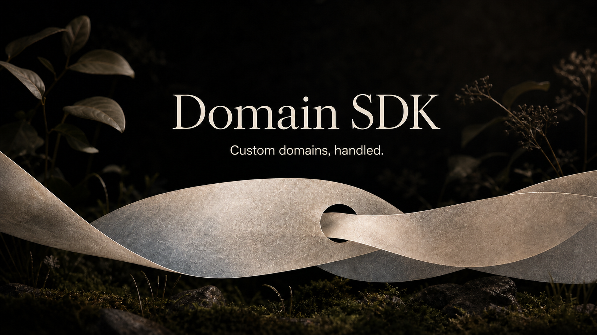

<p align="center">
  
</p>

<p align="center">
  <a href="https://www.npmjs.com/package/@opencoredev/domain-sdk"></a>
  <a href="https://github.com/opencoredev/domain-sdk/stargazers"></a>
  <a href="https://x.com/leodev"></a>
</p>

One TypeScript client for customer domains. Add a hostname to the platform you already run, return the exact DNS records your customer needs, track it until it is ready, and remove it safely.

- Adapters for Vercel, Cloudflare for SaaS, Railway, Render, and Netlify
- One normalized lifecycle for adding, reading, listing, verifying, and removing domains
- Exact routing, ownership, and certificate records for customer-facing DNS instructions
- Provider-authoritative verification and certificate status without false readiness
- Idempotent add and remove operations with normalized, retry-aware errors
- Sequential polling with timeouts, cancellation, callbacks, and provider backoff
- An isolated testing adapter that never calls a real provider

## Install

```bash
npm install @opencoredev/domain-sdk
```

Domain SDK is server-side only and requires Node 20+ or Bun. Keep provider credentials out of browser code.

## Usage

```ts
import { createDomainClient } from "@opencoredev/domain-sdk";
import { vercel } from "@opencoredev/domain-sdk/vercel";

const domains = createDomainClient({
  provider: vercel({
    token: process.env.VERCEL_TOKEN!,
    projectId: process.env.VERCEL_PROJECT_ID!,
  }),
});

const domain = await domains.add("app.customer.com");

for (const record of domain.records.filter((record) => record.required)) {
  console.log(record.type, record.name, record.value);
}

const active = await domains.waitUntilActive(domain.hostname);
```

## Providers

Vercel, Cloudflare for SaaS, Railway, Render, Netlify, and an in-memory testing adapter. Each provider lives behind its own entry point and preserves the platform-specific DNS and verification details your UI needs.

## Documentation

Full docs live at **[domain-sdk.dev/docs](https://domain-sdk.dev/docs)**. Good places to start:

- [Installation](https://domain-sdk.dev/docs/installation)
- [Provider comparison](https://domain-sdk.dev/docs/providers)
- [Contributing](https://domain-sdk.dev/docs/project/contributing)

## Development

```bash
bun install
bun run dev
bun run test
bun run check-types
bun run lint
bun run build
```

The docs run at `http://domain-sdk.localhost:1355` through the sudo-free Portless proxy. Use `PORTLESS=0 bun run dev` to bypass the proxy.

## Releasing

Add a Tegami changelog under `.tegami/`, then run the complete local release:

```bash
bun run release
```

The release tooling requires Node.js 24 or newer.

The command lints, type-checks, and tests the SDK; versions it with Tegami; builds the package; publishes it to npm; and removes the completed publish lock. If publishing fails, Tegami keeps the lock so `bun run tegami publish` can retry safely.

## License

[MIT](./LICENSE)

<p align="center"><sub>Built by <a href="https://x.com/leodev">@leodev</a></sub></p>
